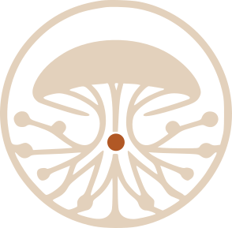

# Biocorredor MR

<p align="center">
  
</p>

<p align="center">
  <strong>Una plataforma comunitaria para observar, documentar y cuidar el territorio.</strong><br />
  Relevamientos de biodiversidad, ambientes y cambios territoriales con trabajo offline.
</p>

<p align="center">
  <a href="https://github.com/Freeak88/biocorredor-mr/actions"></a>
  <a href="https://github.com/Freeak88/biocorredor-mr/releases"></a>
  <a href="LICENSE"></a>
  <a href="LICENSE-DOCS"></a>
  <a href="https://github.com/Freeak88/biocorredor-mr/issues"></a>
</p>

> Este repositorio nace en Ministro Rivadavia, pero está pensado para que
> otros barrios puedan adaptarlo a sus propias salidas, protocolos y mapas.

## Qué resuelve

Biocorredor MR ayuda a equipos comunitarios a:

- organizar jornadas, sectores, equipos y participantes;
- registrar plantas, hongos, aves, anfibios, ambientes e impactos;
- trabajar aunque no haya señal;
- conservar fotografías originales y trazabilidad de fichas físicas;
- sincronizar registros sin duplicarlos;
- visualizar parcelas, zonificación, ambientes y capas territoriales;
- separar información pública de información sensible;
- coordinar recorridos y revisar observaciones con evidencia.

La tecnología acompaña el trabajo de campo: la asignación de jornada, equipo y
sector se prepara antes de salir; el observador registra con la menor cantidad
posible de decisiones y el sistema completa el contexto automáticamente.

## Principios

**Comunidad primero.** La plataforma sirve a vecinos, escuelas, organizaciones,
universidades y equipos técnicos.

**Offline de verdad.** Un registro no depende de que haya Internet en el lugar.

**Evidencia antes que interpretación.** Se conserva la imagen original y se
separan observación, identificación y lectura jurídica.

**Privacidad por diseño.** Las coordenadas sensibles y los datos personales no
se publican por defecto.

**Software libre.** El código puede estudiarse, adaptarse y compartirse bajo
AGPL-3.0-or-later.

## Estado

Versión demo estable: **`v0.1.0-rc3-demo`**
Commit: **`4ae6254`**

Incluye el ciclo MVP de campo, persistencia local, media offline, jornadas,
asignaciones, seguimiento de recorrido, sincronización remota idempotente,
roles operativos, mapa territorial y capas de parcelas GeoARBA preparadas para
Ministro Rivadavia.

## Inicio rápido

### Requisitos

- Node.js 20 o superior;
- npm;
- Docker y Docker Compose;
- una clave de Gemini sólo si se habilitan funciones de identificación asistida;
- un navegador moderno con soporte para PWA, almacenamiento local y GPS.

### Frontend local

```bash
npm ci
Copy-Item .env.example .env.local
npm run dev
```

Abrir <http://localhost:3000/>.

### PocketBase local

```bash
docker compose -f docker-compose.local.yml up --build
npm run dev
```

La API local queda disponible en `http://localhost:8090`. Las migraciones y
hooks se montan desde `pocketbase/`.

### Validación

```bash
npm run lint
npm test -- --run
npm run build
```

Para la demo autenticada se requiere un PocketBase con una asignación activa y
las variables `DEMO_FIELD_EMAIL`, `DEMO_FIELD_PASSWORD` y
`PLAYWRIGHT_BASE_URL`.

## Flujo de campo

1. Coordinación crea una jornada, sectores, equipos y asignaciones.
2. El observador abre **Jornada** y confirma el inicio.
3. **Registrar** sólo está disponible durante una jornada activa.
4. Se captura la observación, la fotografía original y el GPS cuando existe.
5. El registro se guarda primero en el teléfono.
6. Al volver la conexión, se envía al sistema central sin duplicados.
7. Coordinación revisa registros, rutas, evidencias y cierres.

Documentación operativa:

- [Demo reproducible](docs/DEMO_FIELD_FLOW.md)
- [Checklist de jornada](docs/CHECKLIST_JORNADA.md)
- [Usuarios y roles](docs/USUARIOS_ROLES.md)
- [Modelo offline](docs/OFFLINE_MEDIA_MODEL.md)
- [Sincronización](docs/SYNC_MODEL.md)
- [Trazabilidad de fichas y QR](docs/PAPER_TRACEABILITY.md)
- [Datos territoriales y GeoARBA](docs/DATOS_GEOARBA.md)
- [Acta de relevamiento](docs/ACTA_RELEVAMIENTO_TEMPLATE.md)

## Arquitectura

```text
Navegador / PWA
       |
       | mismo origen: /api y /_
       v
Nginx + React/Vite  ----->  PocketBase
                                 |
                         SQLite + archivos
                                 |
                         migraciones + hooks
```

El despliegue Docker productivo contempla `web`, `pb` y un servicio opcional de
pre-render. La composición actual presupone un proxy inverso externo y una red
Docker `proxy-net`; antes de usarla en un VPS hay que completar DNS, HTTPS,
backups, firewall, monitoreo y el procedimiento de restauración.

## Datos y fuentes

Las capas territoriales y las observaciones deben conservar la fuente, fecha,
licencia y nivel de confianza. El proyecto puede integrar datos de GeoARBA,
IDEBA, urBAsig, GBIF y otras fuentes, respetando sus condiciones de uso.

No se deben publicar:

- coordenadas de especies o ambientes sensibles;
- datos identificatorios de participantes;
- información de propiedades privadas sin base documental;
- imágenes sin autorización de uso.

## Contribuir

Leé [CONTRIBUTING.md](CONTRIBUTING.md) antes de abrir un pull request. Para
discusiones de diseño, priorizamos propuestas pequeñas, verificables y útiles
para personas que trabajan con el teléfono en la mano y con conectividad
intermitente.

También podés colaborar con:

- traducciones y lenguaje claro;
- protocolos de relevamiento;
- pruebas de usabilidad;
- cartografía y metadatos de fuentes;
- documentación para nuevos barrios;
- accesibilidad y soporte para dispositivos modestos.

## Licencias

| Material | Licencia |
| --- | --- |
| Software | [AGPL-3.0-or-later](LICENSE) |
| Documentación y materiales comunitarios | [CC BY-SA 4.0](LICENSE-DOCS) |
| Dependencias y datos externos | La licencia de cada proveedor |

La licencia no transfiere derechos sobre mapas, fotografías, datos oficiales,
marcas, bases externas ni contenido aportado por terceros.

## Comunidad

- [Código de conducta](CODE_OF_CONDUCT.md)
- [Seguridad y privacidad](SECURITY.md)
- [Issues](https://github.com/Freeak88/biocorredor-mr/issues)
- [Discusiones](https://github.com/Freeak88/biocorredor-mr/discussions)

Hecho para que la ciencia comunitaria y el cuidado del territorio puedan crecer
de barrio en barrio.
